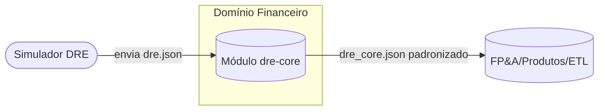
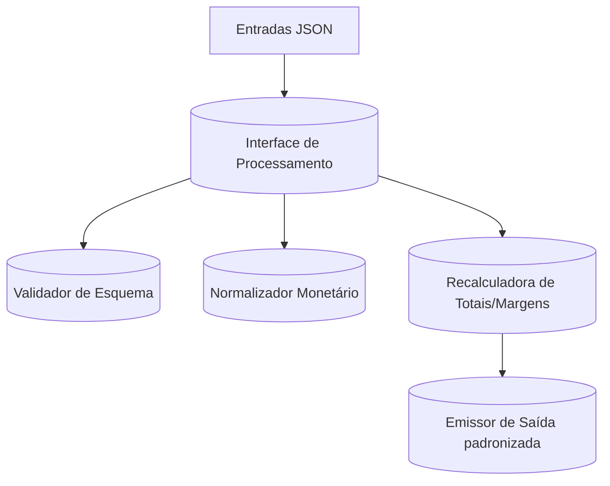
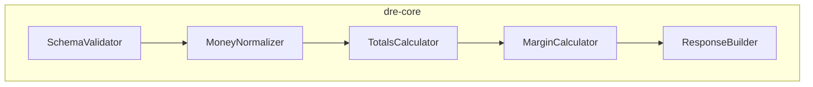
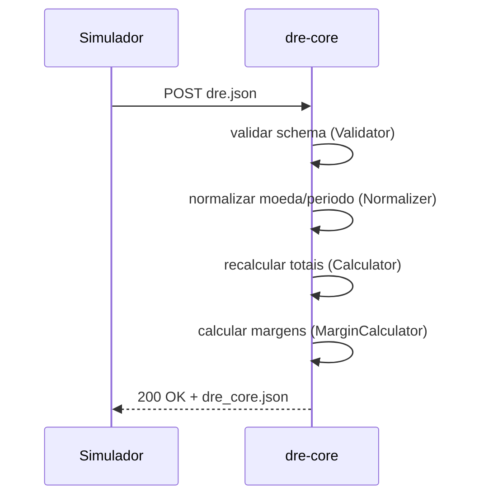
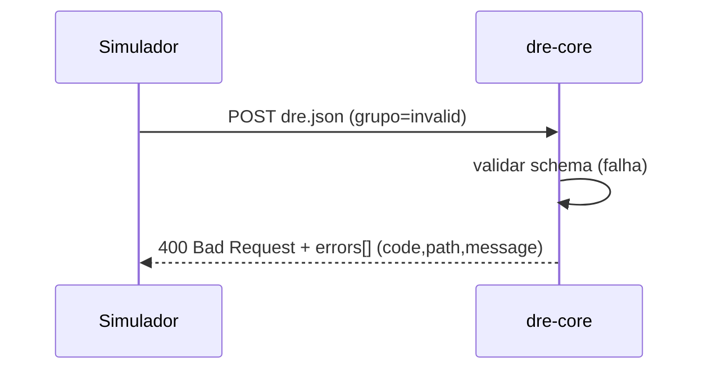

# Design — Contexto, C4 e Sequências

## Contexto do Sistema



Notas:
- Entrada: `dre.json` com `{ periodo, moeda, totais, porConta[] }`.
- Saída: `dre_core.json` com totais recalculados, margens e metadados.

## C4 — Containers (visão lógica)



Responsabilidades:
- Validator: checa schema, tipos, domínios e sinais por grupo.
- Normalizer: converte strings monetárias BR/EN para decimais; padroniza período.
- Calculator: aplica fórmulas dos totais e margens; aplica `aliquotaIR` padrão 0,20.
- Emitter: monta `dre_core.json` e anexa `meta` (warnings, recalcMode, aliquotaIRAplicada).

## C4 — Components (módulos internos)



Interfaces esperadas:
- `SchemaValidator.validate(input) -> {ok, errors[]}`
- `MoneyNormalizer.normalize(input) -> inputNormalizado + warnings[]`
- `TotalsCalculator.recalc(inputNorm) -> totaisRecalc`
- `MarginCalculator.compute(totais) -> margens`
- `ResponseBuilder.build(inputNorm, totais, margens, meta) -> dre_core.json`

## Sequências — Fluxos Críticos

1) Processamento bem‑sucedido



2) Erro de validação (grupo inválido)



## Regras de Cálculo e Sinais
- `receita` deve ser positiva; `deducao`, `custo`, `despesa`, `imposto` devem ser negativas; `outras` pode ser positiva ou negativa.
- Totais expostos são positivos para custos/despesas (ex.: `custoProdutosServicos`, `despesasOperacionais`), com exceção de `outrasReceitasDespesas` que preserva sinal agregado.
- IR: `impostoRenda = max(0.20 * resultadoAntesIR, 0)`; parametrizável por configuração futura.

## Saída padronizada — dre_core.json (esboço)
```
{
  schemaVersion: 1,
  periodo: "YYYY-MM",
  moeda: "BRL",
  totais: {
    receitaBruta, deducoes, receitaLiquida, custoProdutosServicos,
    lucroBruto, despesasMarketing, despesasGeraisAdm, despesasOperacionais,
    resultadoOperacional, outrasReceitasDespesas, resultadoAntesIR,
    impostoRenda, resultadoLiquido
  },
  margens: {
    margemBruta, margemOperacional, margemLiquida
  },
  porConta: [ { id, nome, grupo, valor }... ],
  meta: {
    recalcMode: "recompute",
    aliquotaIRAplicada: 0.20,
    warnings: ["..."]
  }
}
```

