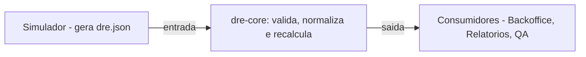
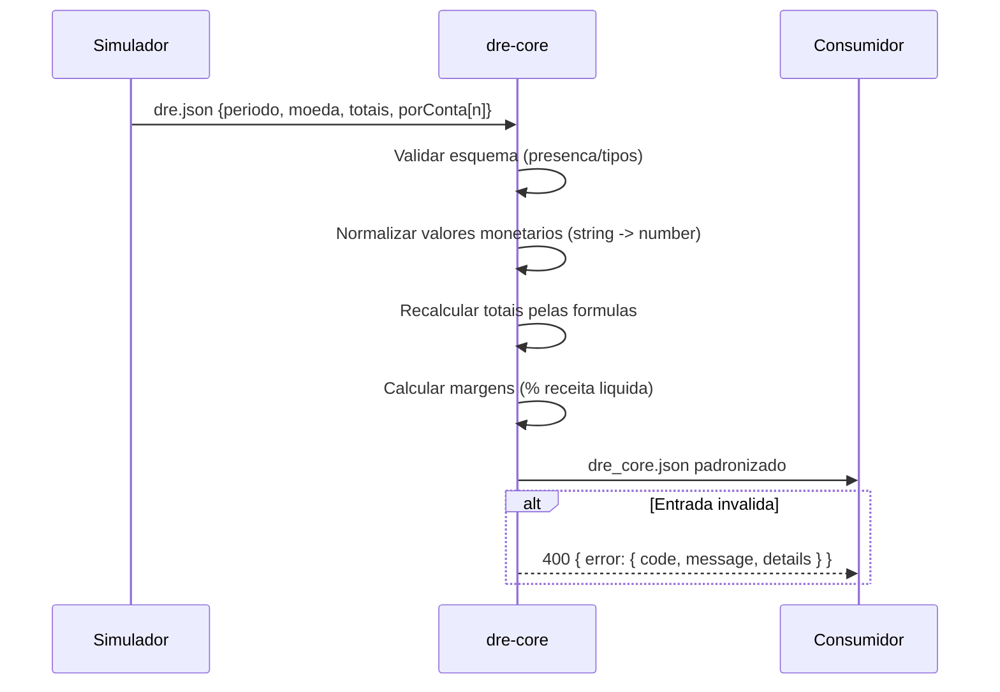

# Design — dre-core

## Visão Geral
O `dre-core` valida e normaliza um `dre.json` vindo do simulador, recalcula totais e margens e retorna um `dre_core.json` padronizado. Projetado como módulo puro (sem dependências externas), podendo ser exposto via CLI/HTTP em camadas superiores.

## Diagrama de Contexto (Mermaid)

## Fluxo de Sequência (Mermaid)

## Estruturas de Dados
- Entrada: conforme `requirements.md` (aceita valores numéricos ou string de moeda em `porConta[].valor`).
- Saída: `dre_core.json` padronizado, com campos numéricos e `margens` calculadas.

## Regras de Cálculo (canônicas)
1) `receitaBruta` = soma de `porConta.valor` com `grupo=receita` (valores tratados como positivos).
2) `deducoes` = soma de absolutos com `grupo=deducao` (armazenado como número positivo no total).
3) `receitaLiquida` = `receitaBruta` - `deducoes`.
4) `custoProdutosServicos` = soma de absolutos `grupo=custo`.
5) `lucroBruto` = `receitaLiquida` - `custoProdutosServicos`.
6) `despesasOperacionais` = soma de absolutos `grupo=despesa`.
7) `resultadoOperacional` = `lucroBruto` - `despesasOperacionais`.
8) `outrasReceitasDespesas` = soma algébrica `grupo=outras`.
9) `resultadoAntesIR` = `resultadoOperacional` + `outrasReceitasDespesas`.
10) `impostoRenda` = soma de absolutos `grupo=imposto`.
11) `resultadoLiquido` = `resultadoAntesIR` - `impostoRenda`.

Margens (% sobre receita líquida; 0 quando `receitaLiquida == 0`):
- `margemBruta`, `margemOperacional`, `margemLiquida`.

## Normalização de Moeda
- Aceitar padrões: `"R$ 10.000,50"`, `"10,000.50"`, `"10000.50"`, `"10.000,50"`.
- Extrair dígitos e separador decimal (último separador não numérico é decimal).
- Converter para `number` com `.` decimal.
- Preservar sinal quando existirem parênteses ou `-`.

## Tratamento de Erros
- Estratégia: validar cedo; acumular erros por campo/índice; retornar 400 com `details[]` granular.
- `code`s sugeridos: `VALIDATION_ERROR`, `UNSUPPORTED_CURRENCY`, `INVALID_PERIOD`, `INVALID_GROUP`.

## Considerações de Implementação
- Módulo puro com funções:
  - `validate(input): ValidationResult`
  - `normalize(input): NormalizedInput`
  - `recalc(input): { totais, margens }`
  - `buildOutput(input, totais, margens): DreCoreJson`
- Determinismo: sem estado global; entradas iguais → saídas iguais.
- Precisão e arredondamento no final de cada etapa macro para evitar drift.
