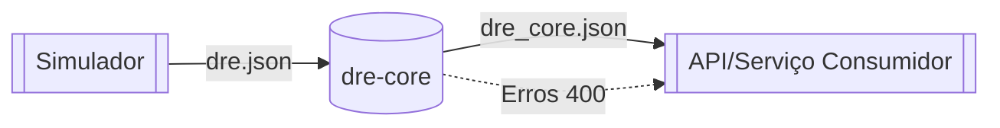
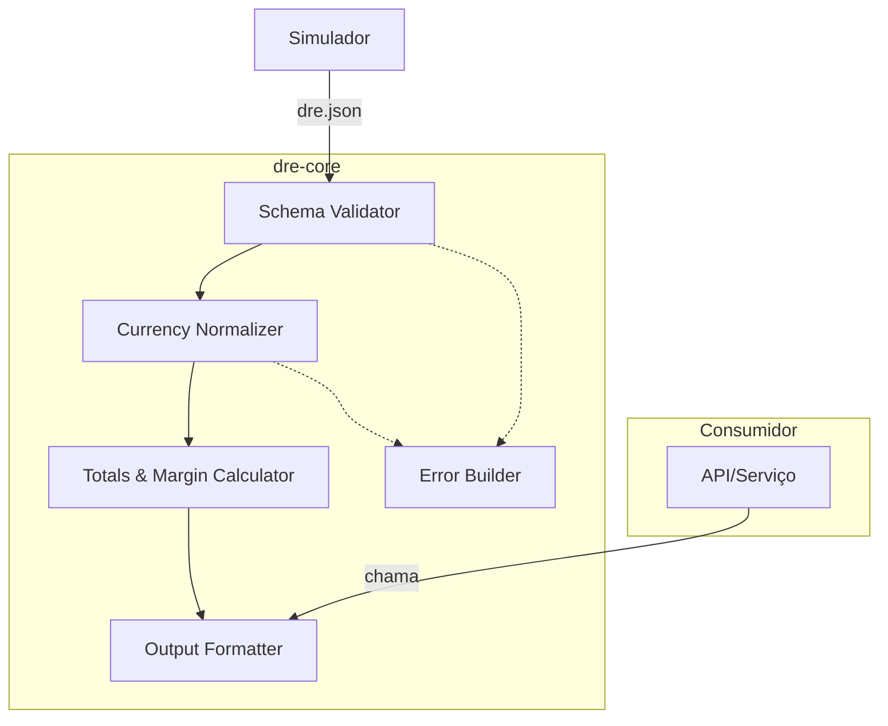
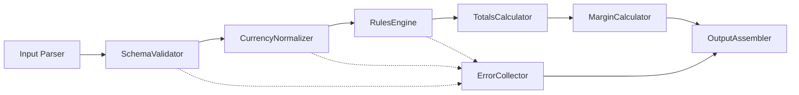
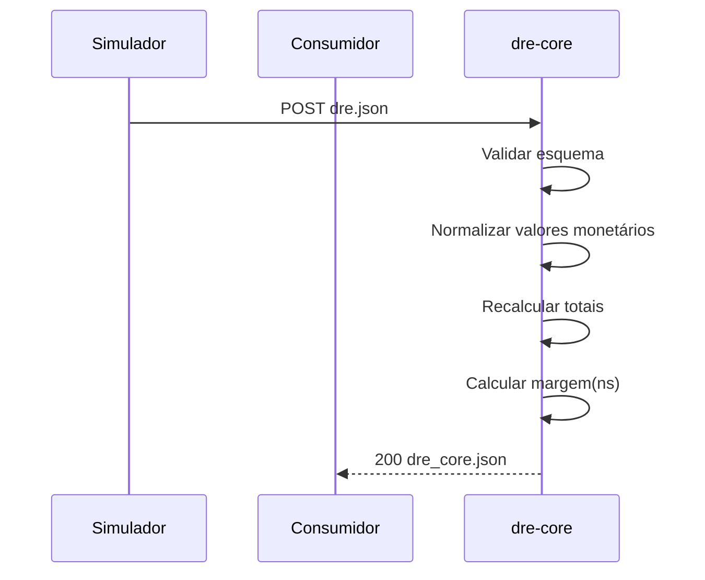
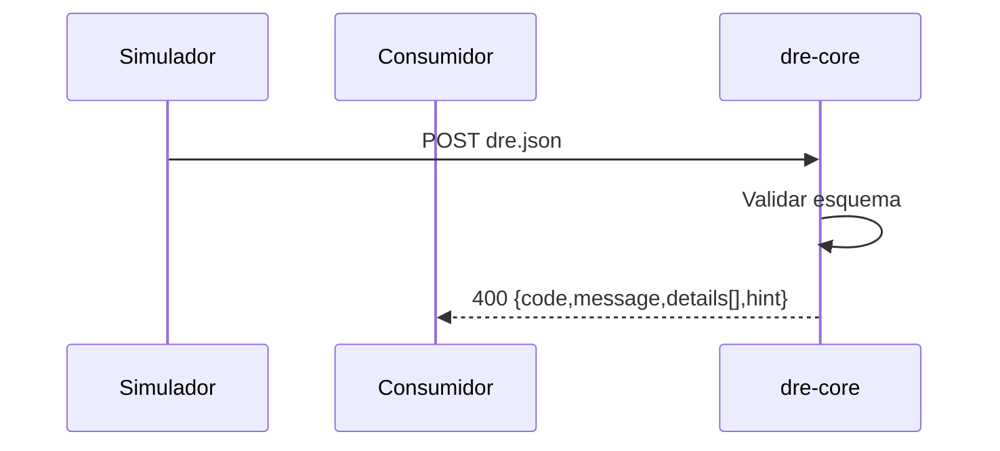

# Design — dre-core

## Contexto e Limites
O `dre-core` é um processador puro de DRE que recebe um `dre.json` do simulador, valida/normaliza os dados financeiros, recalcula totais e margens e retorna um `dre_core.json` padronizado. Não persiste estado e não integra fontes externas.

## Diagrama de Contexto (Mermaid)

## C4 — Containers (alto nível)

## C4 — Components (dentro do dre-core)

## Sequência — Caminho Feliz

## Sequência — Erro de Validação

## Regras/Políticas (resumo)
- Schema mínimo (ver decisions.md) para `periodo`, `totais` e itens de `porConta[]`.
- Política de normalização: aceitar variações BR/US (símbolo, separadores); valores resultam numéricos.
- Fórmulas de totais/margem: ver decisões e fórmulas definidas em `decisions.md`.
- Arredondamento: consistente e documentado em `decisions.md`.

