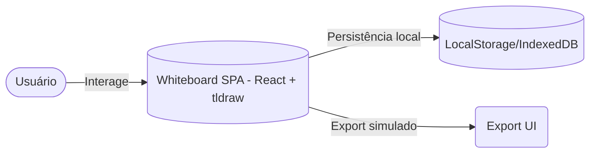
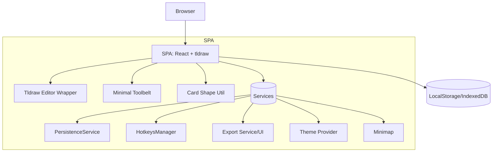
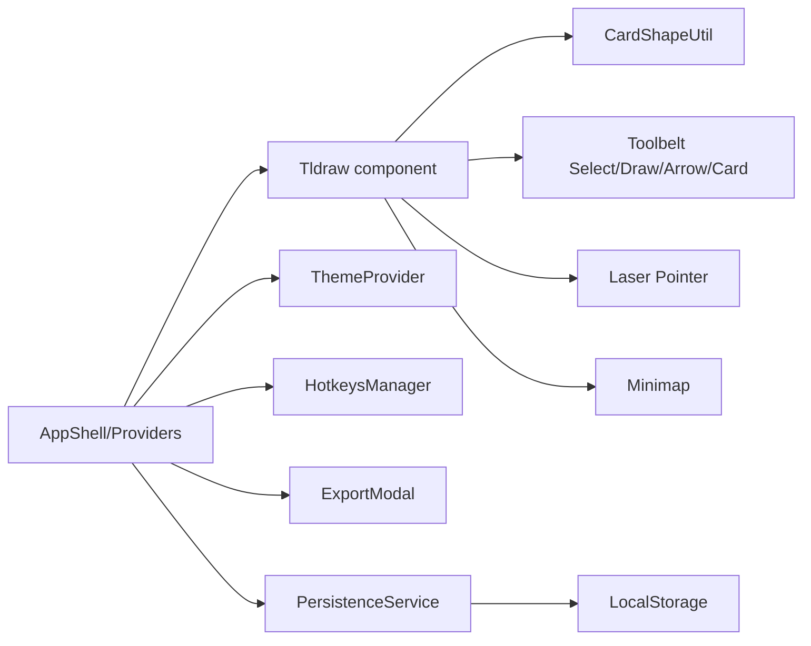
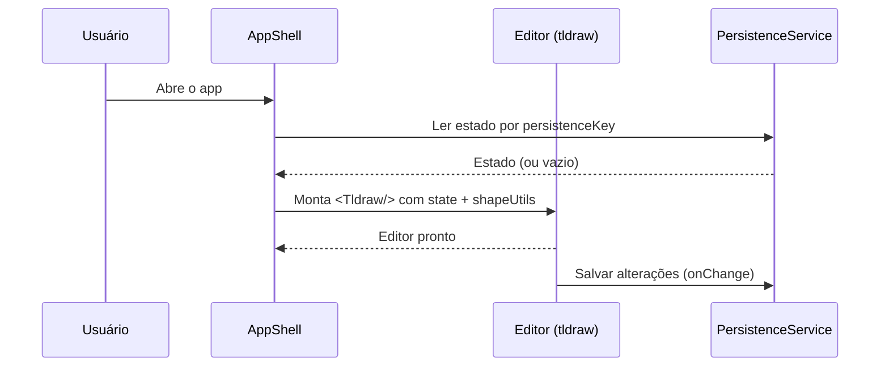
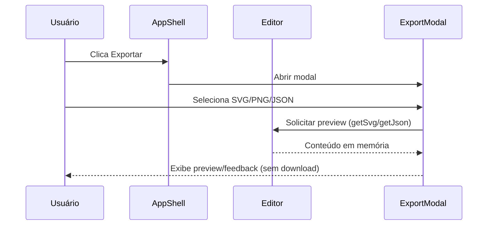

# Design

## Contexto e Decisão
- Stack: React + `tldraw` (v2.x) como SDK de canvas infinito, sem backend.
- Forma: SPA com serviços internos (PersistenceService, HotkeysManager, ExportService/UI, ShapeRegistry); minimap sempre disponível com toggle no UI (sem feature flag).
- Decisão: tldraw como engine pela extensibilidade (custom shapes, UI override, estado), velocidade de entrega e caminho futuro para colaboração.

## Alternativas comparadas
- tldraw (escolhida): + Extensível, shapes custom, ferramentas/atalhos, persistência local simples (`persistenceKey`), laser; − Minimap pode estar instável conforme versão.
- Excalidraw: + Export e mobile maduros; − Custom shapes menos flexíveis sem fork; estética mais opinativa.
- Konva.js: + Controle total baixo nível; − 4–5× esforço para reimplementar editor, seleção, histórico, snapping.

## Diagrama de Contexto (Mermaid)

## C4: Containers (Mermaid)

## C4: Components (Mermaid)

## Sequência – Carregamento/Persistência

## Sequência – Export (simulado)

## Notas de Implementação
- Shape `Card`: util com `getDefaultProps`, `getGeometry`, `component`, `indicator` e `toSvg()/toBackgroundSvg()` para export visual consistente.
- Toolbelt mínima: esconder ferramentas não usadas; hotkeys 1/2/3/N mapeando `select/draw/arrow/card`.
- Minimap: sempre disponível; toggle no UI; se necessário, fallback para overlay simples com viewport.
- Export (simulado): usar `editor.getSvg()`/`editor.store.getSnapshot()` e desabilitar PNG real no MVP.
- Tema: alternância via CSS vars e suporte do tema do `tldraw`.
